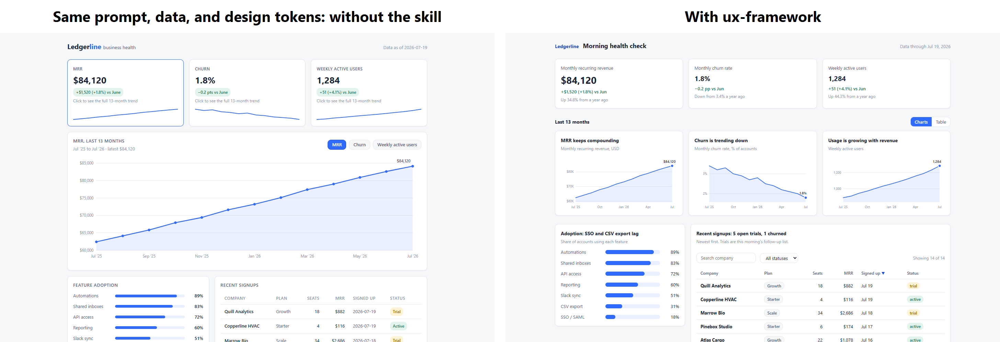
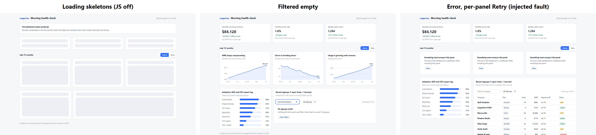

# claude-ux-framework

A Claude Code skill that moves agents from "nice UI" to UX-driven UI
development. Agents are good at local polish (a pretty component, a clean
color scheme) and bad at project-wide UX: information architecture, user
goals, flows across screens, state handling, density decisions. This skill
fixes that with an enforced process, not a rulebook.

## The test: same prompt, same data, same design tokens

Two agents get byte-identical prompts, a pinned dataset both must
hardcode verbatim, and a pinned design-token file both must style from.
The only difference is that one agent is told to follow this skill. Both
outputs are scored against the skill's 40-check audit checklist, by the
supervising session, in code and by interaction. Because the palette,
type, and spacing are fixed, the two builds look like the same product,
and what differs is design judgment, which is the thing being measured.

The published example pair (shown above, shipped in [examples/](examples/)):

| | Blocker | Major | Minor |
|---|---|---|---|
| Without the skill | 1 | 2 | 1 |
| With the skill | 0 | 0 | 0 |

The deltas that persisted across every dashboard-scenario run of the
test, not just this one: state handling (every dashboard baseline
shipped zero empty, loading, error, or partial handling), table
affordances (search, filter, sort), responsive containment (two of the
three dashboard baselines overflow the page at phone width), insight
framing, and keyboard access. The reproducible suite, all run logs,
retracted findings included, and the caveats are in
[docs/validation.md](docs/validation.md).

The blocker is the difference users hit first. The baseline renders the
happy path and nothing else; the with-skill build's states are real code
paths, captured without a demo switcher: skeletons when the page has not
booted, guidance on a zero-result search, and a per-panel Retry when a
render fault is injected. The rest of the dashboard keeps working:

Both builds, the UX spec the skill produced, and the capture script are in
[examples/](examples/).

## What it does

**Build mode.** Before any UI code, the agent writes a short UX spec (who the
user is, their top tasks, where the screen sits in the app, a states matrix).
It then loads the reference module matching the UI type (dashboards,
navigation, tables and data grids), builds, and self-audits against a
checklist before declaring done.

**Audit mode.** Ask for a UX review of an existing app and the agent
inventories screens and flows, looks at the rendered UI where possible, and
returns prioritized findings scored by severity and effort.

## Install

    git clone https://github.com/TarekAwwad/claude-ux-framework

Then copy or link `skills/ux-framework/` into your skills directory:

    # PowerShell (junction, no admin needed)
    New-Item -ItemType Directory -Force "$HOME\.claude\skills" | Out-Null
    New-Item -ItemType Junction -Path "$HOME\.claude\skills\ux-framework" -Target "<repo>\skills\ux-framework"

    # or just copy
    mkdir -p ~/.claude/skills
    cp -r skills/ux-framework ~/.claude/skills/

## Scope

Web apps, stack-agnostic. v1 modules: dashboards and data-heavy UIs,
navigation and app shell, tables and data grids. Forms is planned as a
future module.

## Repo layout

- `skills/ux-framework/` is the installable skill (self-contained)
- `research/` holds the findings the rules were distilled from, with sources
- `examples/` holds the published with/without pair, the spec, and the screenshots
- `validation/` is the reproducible test suite (prompts, fixtures, checks, protocol)
- `docs/validation.md` records the method, all runs, and their scorecards

## Contributing

Issues and PRs welcome. Most useful right now: run audit mode on a real app
and report where the checklist misses. Forms and wizards is the next
planned module.

## License and attribution

[MIT](LICENSE), covering the original content of this repo: the skill, the
examples, the docs, and the wording of the research notes. The files under
`research/` summarize and cite third-party sources (Nielsen Norman Group
articles, Laws of UX, published books and videos). Those summaries are
paraphrase with citation; the underlying works remain their authors' and are
not relicensed by this repo.

This is a community project. It is not affiliated with or endorsed by
Anthropic. Claude is a trademark of Anthropic, used here only to describe
compatibility with Claude Code.
